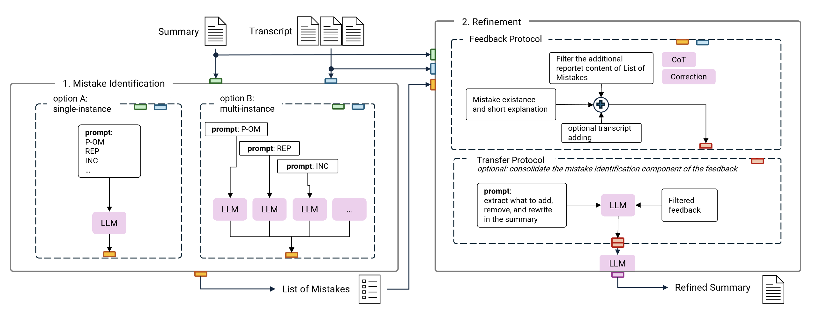
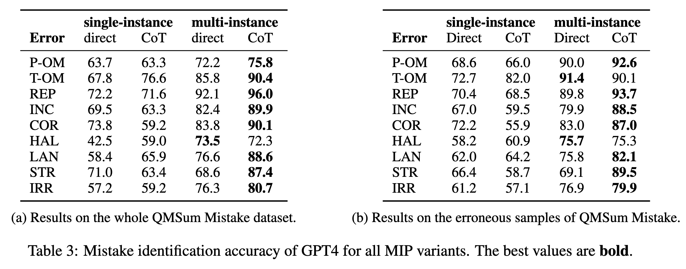
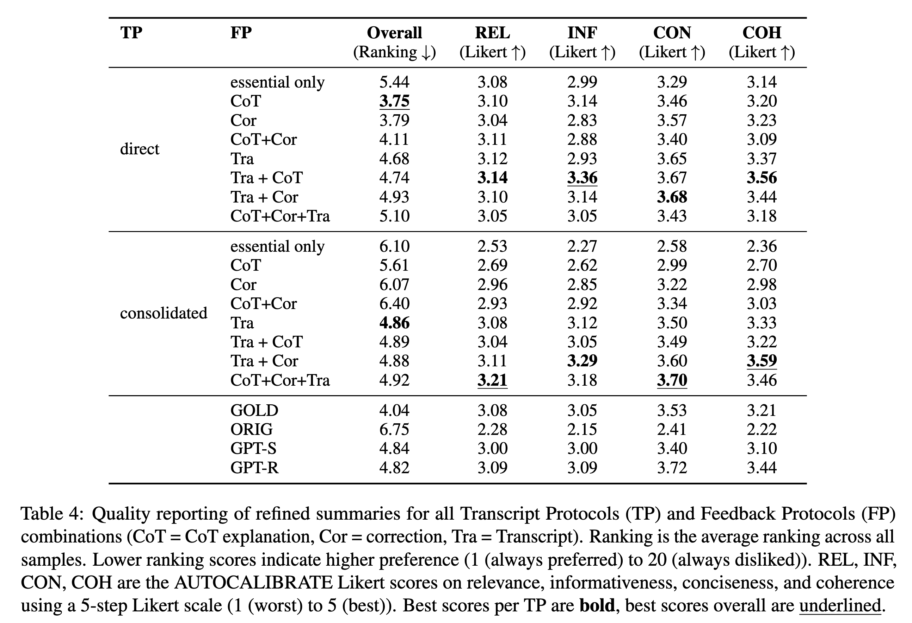

# What's Wrong? Refining Meeting Summaries with LLM Feedback
This software project accompanies the research paper, [What's Wrong? Refining Meeting Summaries with LLM Feedback](https://arxiv.org/abs/2407.11919). **This paper has been accepted to COLING 2025 Main Track.**


## Content of the work
Large Language models (LLMs) reset how to handle the challenges of meeting summarization, such as informal/colloquial language; multiple speakers; complex meeting flow, implicit context.
While LLMs allow for enhanced coherence and context understanding, they are still prone to including irrelevance and hallucination.
Fitting previous approaches to mitigate such weaknesses are not feasible for LLMs out-of-the box, requiring expensive finetuning and re-exploring of approaches.
Instead of crafting LLMs to better work with the summarization task, we use LLMs to address the challenges for meeting summaries directly by refining given summaries.

<p align="center">

</p>

## Results

**Multi-instance setups outperform single-instance approaches in error detection across all error types**
<p align="center">

</p>

- *Why?* Single-model setups struggle with long dependencies and contextualizing complex content,  leading to more missed error instances.
- *What is different?* Multi-instance approaches, especially with CoT prompting, handle context more effectively and reduce false negatives.
- *Caveat:* GPT-4.o can be overly strict in labeling errors and the model’s heuristic influences mistakes related to subjectivity.


<p align="center">

</p>


**A simple ‘error exists’ note is not enough for comprehensive corrections.**

- *Problem:* Vague or minimal feedback fails to pinpoint all error types or offer targeted corrections.
- *Solution:* Providing CoT-style explanations and specific correction hints yields deeper improvements.
- *Also:* Transcript-based refinement suffers from repetitions and lack of depth. This likely stems from content repetition and unnecessary details.


**Use the model’s feedback ‘as is’ for best results**

- *Why Not Edit It?* Consolidating or heavily modifying the generated feedback can dilute essential details. Models rely here more on the transcript for summary rewriting than on the feedback. 
- *Outcome:* Keeping the model’s own feedback intact leads to more accurate refinements.


**Refined summaries better meet user expectations**
- *How?* A two-stage feedback and refinement process systematically corrects more errors in the final summary and increases summary depth.
- *Adaptability:* The number of rewrites depends on the initial summary quality, preserving the original style and tone.

## Run the project
run src/main.py

## Citation
```
@inproceedings{kirstein-etal-2025a,
    title = "What's Wrong? Refining Meeting Summaries with LLM Feedback",
    author = "Kirstein, Frederic  and
      Ruas, Terry  and
      Gipp, Bela",
    year = "2025",
    month = jan,
    booktitle = {Proceedings of the 31th International Conference on Computational Linguistics},
    publisher = {International Committee on Computational Linguistics},
    address = {Abu Dhabi, the United Arab Emirates},
}
```
